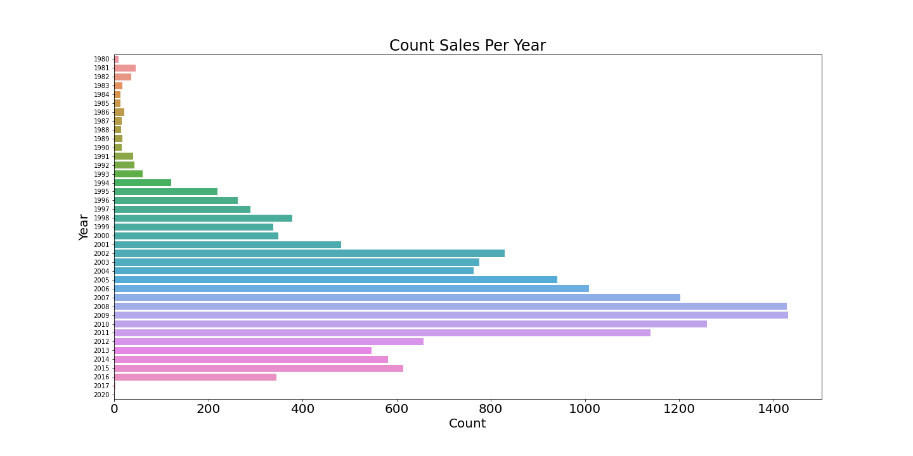
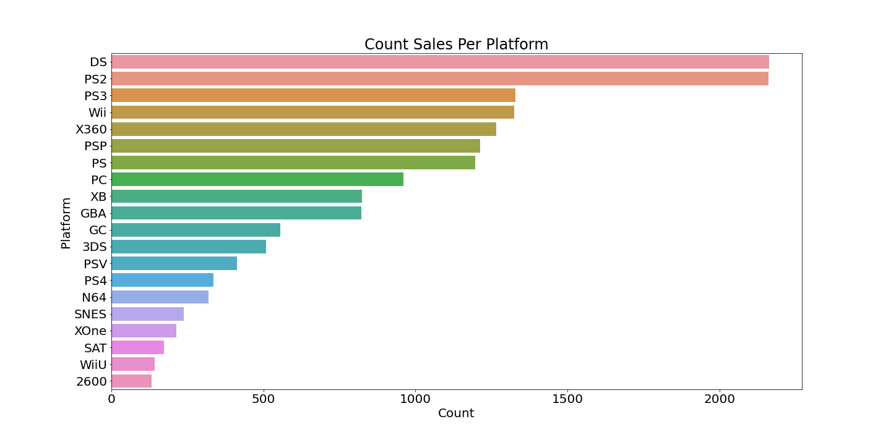
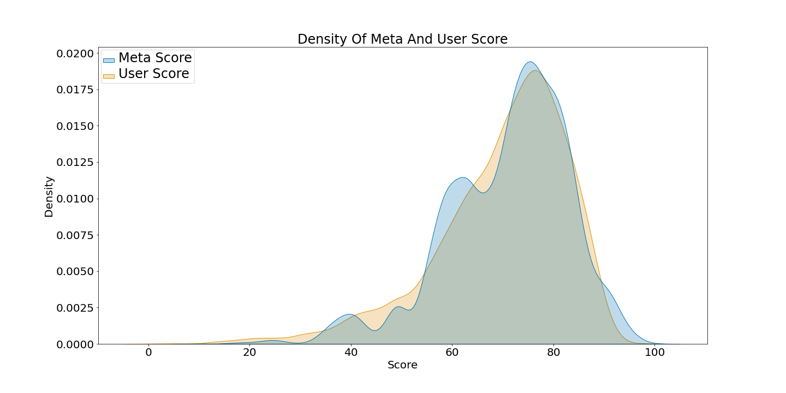
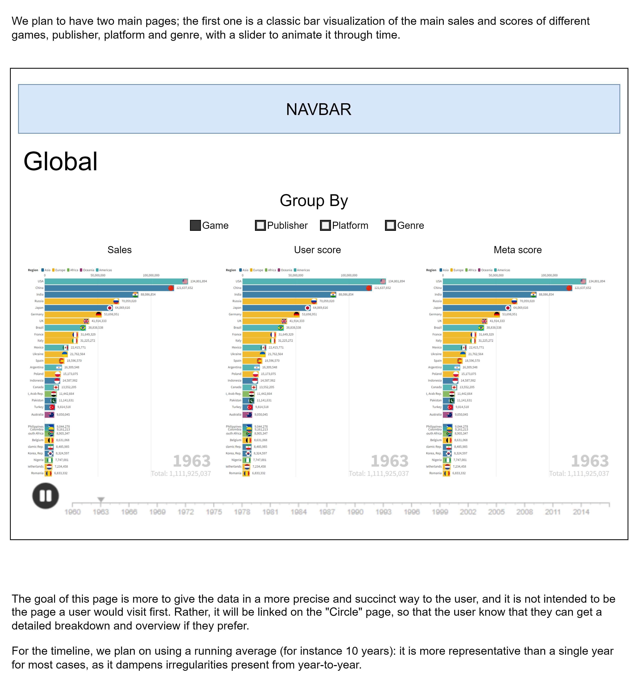
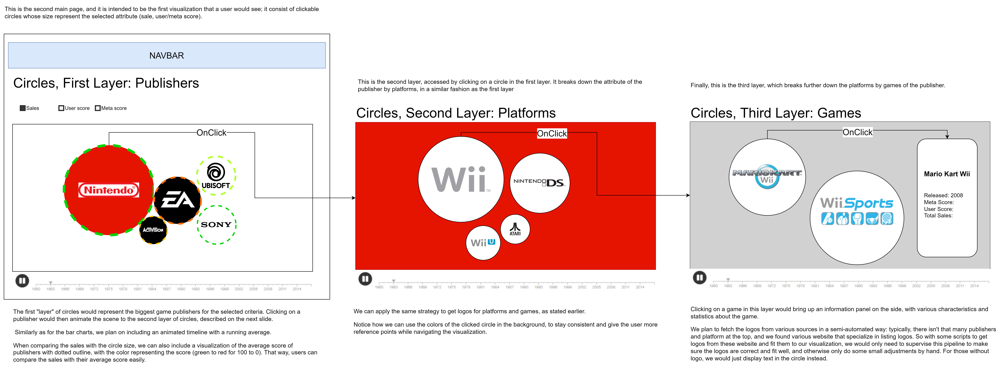

# Milestone 1

## Dataset
Our work focuses on two datasets [Video Game Sales | Kaggle](https://www.kaggle.com/datasets/gregorut/videogamesales) and [Metacritic Ratings | Kaggle](https://www.kaggle.com/datasets/xcherry/games-of-all-time-from-metacritic). It’s data on sales and ratings of video games.

The first one, [Video Game Sales | Kaggle](https://www.kaggle.com/datasets/gregorut/videogamesales), comes from a scrape of the [vgchartz.com](https://vgchartz.com) website. It contains 16 598 records with the name, platform, publisher, year, genre and the related sales in europe, north-america, japan and others.

The second, [Metacritic Ratings | Kaggle](https://www.kaggle.com/datasets/xcherry/games-of-all-time-from-metacritic), includes all games from [Metacritics](https://www.metacritic.com/browse/games/score/metascore/all/all/filtered) at the time of publication. It contains records for 8831 games, scrapped from the website, with details about the score assigned by critics and users, platform, genre, developer, and link to the review of the game.

The first dataset is clean, there is some data missing as the `Year` and `Publisher` that we can easily complete manually.

The second dataset is less clean: for most columns, it is very similar to the first one: there are a few missing values for the ‘developer’ and ‘genre’ that we can complete by hand. However, there is about a quarter of the column ‘type’ (singleplayer, multiplayer, …) with no values, which is problematic; we will try to scrape the Metacritic page again for those entries to fix this. (There is also a lot of missing values for the age rating, but we don’t plan to use this column)

We want to merge those two datasets, such that we can work on one unified basis. That way, the two dataset will complement each other on the different categories (e.g. some platforms are missing on one but not the other, so merging smartly means we can have a more complete list of platforms), and we can make sure we have complete data points for analysis. We plan to do that by joining on the name of the video games; most names are the same in both datasets, but we will implement strategies to match names with slight variations between the datasets.

## Problematic
In this project, we want to explore the different relationships between a video game’s sales success and its reception by players and critics, and how it evolved over time.

Are the user ratings correlated to the sales success of a video game ? How did the market evolve over time, in terms of genre and market sales, in different countries ?

Video games are still widely considered to be a new form of entertainment, despite existing for more than 50 years, and only recently has it been popularized to a larger and larger extent. For instance, in 2020, the video game market exceeded 300 billion in revenue, up from 8 billion in 2000. 

With the advent of the internet, it has also become a rapidly changing and unpredictable market, with many trends coming and going, and many different opinions on the state of the industry. We are currently in a social world and studies about the reasons for success show a high unpredictability and dependency on the opinions of users in a cultural market.[1](#bibliography)

Therefore, it is useful and interesting to analyze how that all evolved, and what was successful throughout the years in terms of sales and critical reception.

We plan to visualize our data based on the different main markets (Europe, North America and Japan), and use different interactive visualizations to show how these markets developed over time. The goal is to clearly see trends in genre, popularity and sales for the different years, and how they unfolded or went away.

## Exploratory Data Analysis

For our exploratory data analysis, we made a [notebook](code/data_exploration.ipynb) containing basic statistics and simple visualizations.

This graph illustrates the main problem with the first dataset, which is the distribution of samples over the year, where the majority of samples are between 2002 and 2010.

This problem is reflected in the rest of the statistics as for example the number of samples related to the DS and the PS2 are over represented.

However, this problem should not impact the results of our problematic and our visualizations.

The second dataset is less complete than the first one concerning extra information about the game, like developer, platforms, genre and type, but this will be compensated by the first dataset during merging. 
It has however all the scores for the game in it’s repertory, both the critic’s score and user score; They are displayed side by side below:

As we can see, they are overall very close. This is an important aspect: if critics don’t reflect the public’s opinion, one can ask if they should be trusted. Yet there still are interesting differences between the two: for instance, the critic scores tend to be rounded to the nearest tenth, whereas the user score follows a smoother gaussian, as there are often few critics for many users leaving ratings (that are then averaged) on a particular game.

Finally, it is important to keep in mind that users can be much more subjective than paid critics; for instance, games can be subject to “review bombing”, where (part of) the community manifest their disapproval of the developer/publisher’s decisions by leaving very negative reviews en masse.

## Related Work
A full exploratory data analysis and a data visualization is already done on the first dataset [Video Game Sales EDA, Visualizations, ML Models](https://www.kaggle.com/code/vikasukani/video-game-sales-eda-visualizations-ml-models/notebook).

Our approach takes both data sets together to answer the problematic, which has not yet been done on any of these datasets.

We will be inspired by the visualization already done on the first dataset for our own visualization

## Bibliography
1. Experimental Study of Inequality and Unpredictability in an Artificial Cultural Market.
 &nbsp;&nbsp;&nbsp;
SCIENCE • 10 Feb 2006 • Vol 311, Issue 5762
 &nbsp;&nbsp;&nbsp;
MATTHEW J. SALGANIKPETER SHERIDAN DODDSAND DUNCAN J. WATTS

# Milestone 2

## Sketch

## Tools:
To sketch the visualization and organize it,we are using Draw.io. It is a simple and intuitive tool to design interfaces, and it allows us to quickly sketch our ideas.

To implement the website itself, we plan on using GitHub Pages. It is a static site hosting service that takes HTML, CSS, and JavaScript files straight from a repository on GitHub, and it is a convenient, free, and straightforward way of creating a simple website to host our visualizations.

To implement said visualization, we plan on using Javascript, with various resources from the course and online tutorials.

Finally, we will use Python and its Pandas library to calculate the various statistics, just like we did for the previous milestone. It is a very common choice for this kind of application, as it is a very powerful library, and with which we have lots of experience. We’ll also use Python to write scraping scripts for the logos.

There’s several tips and information we can use from the lectures, for instance lectures 4 and 5 give a lot of useful tips, and introduce D3.js which we will use for the animations. Lecture 6 also has useful elements, in regards to marks and channels that we will use. Finally lecture 7 gives great guidelines and info on making charts and plots, and on conceiving a data visualization.

Below are links to various website we will use:
Link to the main website on Github Pages: https://com-480-data-visualization.github.io/datavis-project-2022-team-mike/index.html
Link to the logo-listing website: https://logos.fandom.com/wiki/

## Implementation pipeline:
We want to focus on getting the “circle” idea working in priority, as it is the main idea of our visualization. Particularly, we want to have these main elements: Size of the circle linked to the attribute, clicking on the circles to navigate between layers, and a timeline that can be navigated/animated. To do that, we have to implement the python scripts to fetch and calculate the relevant data from the database, and we have to implement the main widget for the visualization. 
Then, we can get the second main page working, to give more detailed breakdowns of the data; it should be simpler to implement, as it uses many of the same concepts as the “circle” idea.

Finally, we want to focus on having visually appealing results, with the use of logos inside circles and the scores on the perimeters, as explained in the sketch. We’re confident we can get the logo idea to work (at least for the main publishers/platforms/games), but as it is not critical, we will leave it for the end. Similarly, we want to optimize the way the visualization is computed, using cache and precomputation to minimize load on the server and client.

# Milestone 3

The Progress book and the screen recording can be found at the root of this directory; otherwise, both the main and Page branch contain our source code used to create the visualizations.

- Website: [datavis-project-2022-team-mike](https://com-480-data-visualization.github.io/datavis-project-2022-team-mike)
- Progress book: [Progress_book.pdf](Progress_book.pdf)
- DatavizScreenCap: [DatavizScreenCap.mp4](DatavizScreenCap.mp4)
